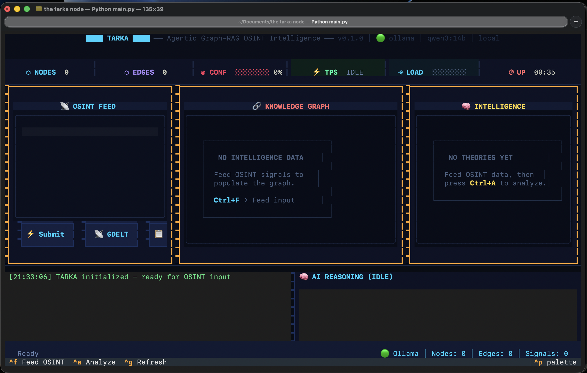

# TARKA — Agentic Graph-RAG OSINT Intelligence



TARKA is a powerful OSINT (Open Source Intelligence) system that autonomously bridges logical gaps in intelligence data using local and cloud-based Large Language Models (LLMs). It builds a dynamic knowledge graph from various data sources, detects anomalies, and uses AI agents to infer missing connections and generate coherent intelligence theories.

## 🚀 Key Features

- **Agentic Reasoning**: Uses autonomous agents to analyze data, extract entities, and bridge "logical gaps" in the knowledge graph.
- **Graph-RAG Architecture**: Combines Knowledge Graphs with Retrieval-Augmented Generation for deep, contextual intelligence analysis.
- **Multi-Model Support**:
  - **Local**: Integration with Ollama (e.g., `qwen3:14b`).
  - **Cloud**: Integration with Google Gemini (e.g., `gemini-2.5-flash`).
- **Interactive TUI**: A rich, dynamic Terminal User Interface (built with Textual) for real-time monitoring and interaction.
- **REST API**: FastAPI-based server for external tool integration and headless operation.
- **OSINT Sources**: Integrated with GDELT for real-time global news monitoring and DuckDuckGo for search-verified gap bridging.

## 🛠️ Setup & Installation

### Prerequisites

- Python 3.10+
- [Ollama](https://ollama.com/) (for local LLM support)
- Google Gemini API Key (optional, for cloud LLM support)

### Installation

1. **Clone the repository:**
   ```bash
   git clone https://github.com/[your-username]/the-tarka-node.git
   cd the-tarka-node
   ```

2. **Create a virtual environment:**
   ```bash
   python -m venv venv
   source venv/bin/activate  # On Windows: venv\Scripts\activate
   ```

3. **Install dependencies:**
   ```bash
   pip install -r requirements.txt
   ```

4. **Configure environment variables:**
   ```bash
   cp .env.example .env
   ```
   Edit `.env` and provide your API keys and preferred model settings.

## 🖥️ Usage

Lauch the TARKA TUI dashboard:
```bash
python main.py
```

Run in headless API-only mode:
```bash
python main.py --api-only
```

### Command Line Arguments

- `--api-only`: Run without the TUI interface.
- `--port`: Specify the API server port (default: 8901).
- `--provider`: Choose LLM provider (`ollama` or `gemini`).
- `--model`: Specify the model name.

## 🧪 Testing

Run the test suite using pytest:
```bash
pytest
```

## 📜 License

This project is licensed under the MIT License - see the [LICENSE](LICENSE) file for details.
